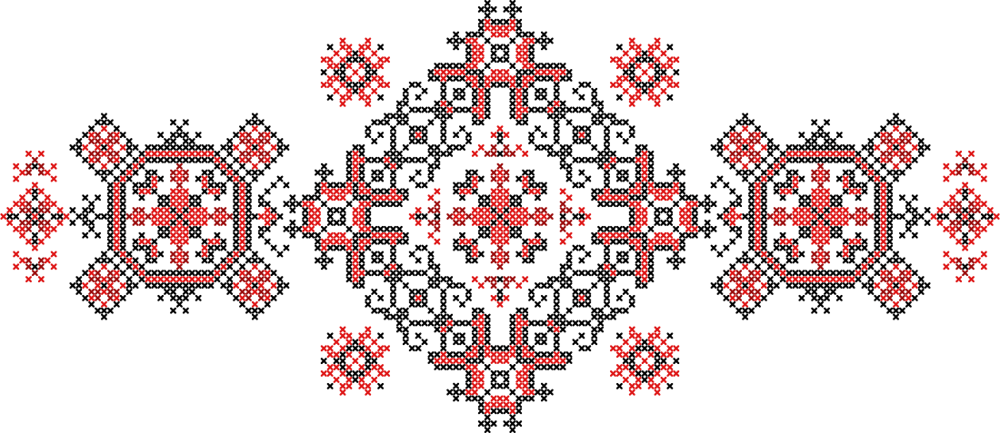
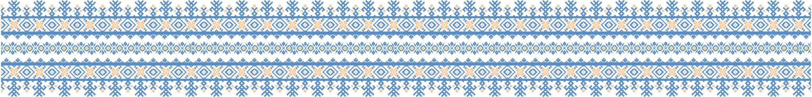

<h1> Hello there </h1>

 Enthusiastic about the convergence of embedded systems and machine learning. My primary interest lies in EdgeAI, 
with a specific focus on embedded machine learning technologies like TinyML. I am eager to learn and apply machine 
learning and computer vision skills to contribute to the industrial domain. Dedicated to exploring new avenues for 
innovative solutions at the intersection of hardware and artificial intelligence.

<table>
  <tr>
    <td rowspan="3" colspan="1"></td>
    <td rowspan="1" colspan="1"></td>
    <td rowspan="3" colspan="1"></td>
  </tr>
  <tr></tr>
  <tr>
    <td rowspan="1" colspan="1"></td>
  </tr>
</table>

<table>
    <tr>
        <td rowspan="5" colspan="4"></td>
        <td rowspan="5" colspan="4"><h3>Electronics</h3>

            I used to study electronics: physics laws in Physics course, electric physics and 
            basics of using oscilloscope in Electronics course, logic gates, flip-flops, counters, registers, etc. in 
            Circuit Design course, timers, PWM, ADC, DAC, etc. in Microcontrollers course and so on. I also had some 
            experience with several Arduino  boards (using Proteus for simulation), STM32 board (using CubeMX) and some 
            outdated custom boards from the university, based on Intel 8086 microprocessor. I also had
            some hands-on experience with Raspberry Pi, Arduino, ESP32, etc. Got some experience with sensors, soldering,
            circuits, etc.  
        
</td>
        <td rowspan="1" colspan="1"></td>
        <td rowspan="1" colspan="1"></td>
    </tr>
    <tr></tr>
    <tr>
        <td rowspan="1" colspan="1"></td>
        <td rowspan="1" colspan="1"></td>
    </tr>
    <tr></tr>
    <tr>
        <td rowspan="1" colspan="1"></td>
        <td rowspan="1" colspan="1"></td>
    </tr>
</table>

<table align="center">
    <tr>
        <td rowspan="10" colspan="1">
            <h3>Courses and Programms</h3>
            <ul>
                <li>
                    
                    Elements of AI by University of Helsinki
                    <a href="https://certificates.mooc.fi/validate/h7k4pfunp1g">Click</a>
                </li>
                <li>
                    
                    Introduction to Embedded Machine Learning by Edge Impulse (Coursera)
                    <a href="https://www.coursera.org/account/accomplishments/verify/MAB4EDVQH7UL">Click</a>
                </li>
                <li>
                    
                    Introduction to Machine Learning by University of Macerata (6 credits)      
                    <a href="https://drive.google.com/file/d/1keBw1xWWl-OlDfhAZua5JF2o9nYSg0_O/view">Click</a>
                </li>
                <li>
                    
                    Machine Learning by Stanford University (Coursera) 
                    <a href="https://www.coursera.org/account/accomplishments/certificate/9K6VN84G6KEB">Click</a>
                </li>
                <li>
                    
                    Data Science Fundamentals by DataRoot University
                    <a href="https://datarootlabs.com/university/verify/2802bd86096d">Click</a> 
                    
                    
                    
                    
                </li>
                <li>
                    
                    Google for Developers: Machine Learning Bootcamp Ukraine
                    <a href="https://rsvp.withgoogle.com/events/ml-bootcamp-ukraine/home">Program description</a>
                </li>
                <li>
                    
                    DeepLearning.AI TensorFlow Developer Professional Certificate
                    <a href="https://www.coursera.org/account/accomplishments/professional-cert/2HLBGJNS4RGG">Click</a>
                    <ul>
                        <li>
                            Introduction to TensorFlow for Artificial Intelligence, Machine Learning,   and Deep Learning
                        
                        </li>
                        <li>
                            Convolutional Neural Networks in TensorFlow
                        
                        </li>
                        <li>
                            Natural Language Processing in TensorFlow
                        
                        </li>
                        <li>
                            Sequences, Time Series and Prediction
                         
                        </li>
                    </ul>
                </li>
                <li>
                    
                    TensorFlow Developer Certificate
                    <a href="https://www.credential.net/34d4d331-b086-4d5b-9080-acd4eb2a9b27">Credential</a>
                </li>
                <li>
                    
                    Grow your career with Google Cloud: AI & Data (Ukraine)
                    <a href="https://rsvp.withgoogle.com/events/grow-your-career-with-google-cloud/about">Program description</a>
                </li>
                <li>
                    
                    Grow your career with Google Cloud (Poland)
                    <a href="https://rsvp.withgoogle.com/events/rozwinkarierezgooglecloud/o-programie">Program description</a>
                </li>
                <li>
                    
                    JetBrains Academy (Hyperskill) 
                    
                </li>
            </ul>
        </td>
        <td rowspan="3" colspan="1"> 
        </td>
    </tr>
    <tr></tr>
    <tr></tr>
    <tr></tr>
    <tr>
        <td rowspan="6" colspan="1">

        <h2>Machine Learning</h2>
        
 I am interested in machine learning and  computer vision. I have experience with  TensorFlow, PyTorch and OpenCV.
            I am  still learning and trying to improve my  skills in this field. I am also interested in  TinyML and EdgeAI. 
            I have completed several courses in this  field and have some certificates. I learned  basics of machine learning
            algorithms, such as linear regression, logistic regression, neural networks, K-means clustering, PCA, SVM.  I also
            learned how to use TensorFlow, using CNN, RNN, LSTM. I have small experience with OpenCV, I used it for detecting 
            system on Raspberry Pi for robot. I also have experience with TinyML, I used TensorFlow Lite on Arduino Nano 33
            BLE.  Now I am working on my own project, that includes detecting objects on the
            aerial images.  
            Still a lot to learn, still need to build more solid knowledge and experience.
        

        </td>
    </tr>
</table>

<h3 align="center"> University Courses </h3>

I am a V. N. Karazin Kharkiv National University graduate and current student at Kyoto University of Advanced Science.
I share my solutions of assignments here.

<table>
    <tr>
        <td rowspan="1" colspan="1">
            <h4> Karazin Kharkiv National University </h4>
            <table align="center">
                <tr>
                    <td> 
                        

                            
1 year courses

                            <table>
                                <tr>
                                    <td></td>
                                    <td></td>
                                </tr>
                            </table>
                        

                    </td>
                    <td>
                        

                            
2 year courses

                            <table>
                                <tr>
                                    <td></td>
                                    <td></td>
                                </tr>
                                <tr>
                                    <td></td>
                                </tr>
                            </table>
                        

                    </td>
                </tr>
                <tr></tr>
                <tr>
                    <td>
                        

                            
3 year courses

                            <table>
                                <tr>
                                    <td></td>
                                    <td></td>
                                </tr>
                                <tr>
                                    <td></td>
                                    <td></td>
                                </tr>
                                <tr>
                                    <td></td>
                                    <td></td>
                                </tr>
                                <tr>
                                    <td></td>
                                    <td></td>
                                </tr>
                            </table>
                        

                    </td>
                    <td> 
                        

                            
4 year courses

                            <table>
                                <tr>
                                    <td></td>
                                    <td></td>
                                </tr>
                                <tr>
                                    <td></td>
                                    <td></td>
                                </tr>
                                <tr>
                                    <td></td>
                                    <td></td>
                                </tr>
                            </table>
                        

                    </td>
                </tr>
            </table>
        </td>
        <td>
            <h4> Kyoto University of Advanced Science </h4>
            <table>
                <tr>
                    <td>
                        

                            
1 year courses

                            <table>
                                <tr>
                                    <td></td>
                                    <td></td>
                                </tr>
                                <tr>
                                    <td></td>
                                    <td></td>
                                </tr>
                            </table>
                        

                    </td>
                    <td>
                        

                            
2 year courses

                            <table>
                                <tr>
                                    <td></td>
                                    <td></td>
                                </tr>
                                <tr>
                                    <td></td>
                                    <td></td>
                                </tr>
                            </table>
                        

                    </td>
                </tr>
                <tr></tr>
                <tr>
                    <td>
                        

                            
3 year courses

                            
Not yet

                        

                    </td>
                    <td>
                        

                            
4 year courses

                            
Not yet

                        

                    </td>
                </tr>
            </table>
        </td>
    </tr>
</table>

<h3 align="center"> Google Cloud Platform </h3>

 

 

